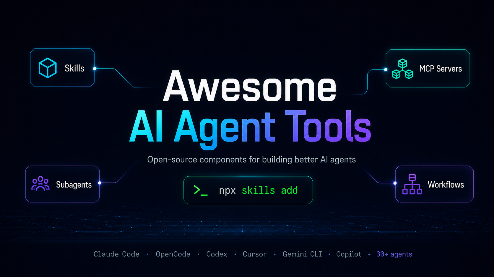

# Awesome AI Agent Tools

<p align="center">
  
</p>

> **The definitive directory of AI agent components.** 611 installable skills, MCP servers, agent workflows, subagents, hooks, plugins, prompts, and tools -- curated from 100+ repositories. Works with Claude Code, OpenCode, Codex, Cursor, Gemini CLI, Copilot, Windsurf, Aider, and 30+ tools.

<p align="center">
  <a href="https://github.com/michielhdoteth/awesome-ai-agent-tools/stargazers"></a>
  <a href="https://github.com/michielhdoteth/awesome-ai-agent-tools/forks"></a>
  <a href="https://github.com/michielhdoteth/awesome-ai-agent-tools"></a>
  <a href="https://github.com/michielhdoteth/awesome-ai-agent-tools/blob/main/LICENSE"></a>
  <a href="https://github.com/michielhdoteth/awesome-ai-agent-tools/pulls"></a>
  <a href="https://awesome.re"></a>
</p>

<p align="center">
  <a href="https://agentskills.io"></a>
  <a href="https://modelcontextprotocol.io"></a>
  <a href="https://github.com/topics/awesome"></a>
</p>

---

## Contents

- [What is this?](#what-is-this)
- [Quick Start](#quick-start)
- [Browse by Category](#browse-by-category)
- [Skills (88 curated)](#skills-88-curated)
- [MCP Servers (110 servers)](#mcp-servers-110-servers)
- [Agent Loops (115 workflows)](#agent-loops-115-workflows)
- [Subagents (32 agents)](#subagents-32-agents)
- [Hooks (25 hooks)](#hooks-25-hooks)
- [Plugins (53 plugins)](#plugins-53-plugins)
- [Prompts (122 prompts)](#prompts-122-prompts)
- [Tools (66 CLI tools)](#tools-66-cli-tools)
- [Cross-Platform Compatibility](#cross-platform-compatibility)
- [Contribute with Your Agent](#contribute-with-your-agent)
- [Contributing](#contributing)
- [License](#license)

---

## What is this?

Awesome AI Agent Tools is the **definitive directory** of AI agent components. Not a list of links -- actual installable skill files, MCP server configs, agent workflows, subagents, and plugins you can drop into any project.

### Who it's for

Developers using Claude Code, OpenCode, Codex, Cursor, GitHub Copilot, Gemini CLI, KiloCode, Aider, Windsurf, or any AI coding assistant. Works with Claude, GPT-4, Gemini, and open-source LLMs.

### What makes this different

<table width="100%">
  <thead>
    <tr>
      <th align="left">Feature</th>
      <th align="center">This repo</th>
      <th align="center">Typical awesome lists</th>
    </tr>
  </thead>
  <tbody>
    <tr><td>Installable skill files</td><td align="center">89 SKILL.md files</td><td align="center">Links only</td></tr>
    <tr><td>MCP server configs</td><td align="center">108 servers + install cmds</td><td align="center">Links only</td></tr>
    <tr><td>Agent workflows</td><td align="center">113 loops with prompts</td><td align="center">Links only</td></tr>
    <tr><td>Subagents</td><td align="center">32 agents + model routing</td><td align="center">No</td></tr>
    <tr><td>Hooks</td><td align="center">25 production-ready hooks</td><td align="center">No</td></tr>
    <tr><td>Plugins</td><td align="center">53 plugins across 9 platforms</td><td align="center">No</td></tr>
    <tr><td>Prompts</td><td align="center">122 curated prompts + 310K marketplace</td><td align="center">Links only</td></tr>
    <tr><td>CLI Tools</td><td align="center">66 tools with install cmds</td><td align="center">No</td></tr>
    <tr><td>Catalogs with metadata</td><td align="center">JSON catalogs for discovery</td><td align="center">No</td></tr>
    <tr><td>Cross-platform</td><td align="center">30+ AI tools</td><td align="center">Varies</td></tr>
    <tr><td>Agent-contributable</td><td align="center">Automated fork+PR skill</td><td align="center">No</td></tr>
  </tbody>
</table>

---

## Quick Start

### Option 1: Install via skills.sh (recommended)

```bash
npx skills add michielhdoteth/awesome-ai-agent-tools
```

### Option 2: Clone and explore

```bash
git clone https://github.com/michielhdoteth/awesome-ai-agent-tools.git
cd awesome-ai-agent-tools

# Browse the catalogs
cat skills/catalog.json | jq '.skills | length'
cat mcps/catalog.json | jq '.servers | length'
cat loops/catalog.json | jq '.loops | length'
```

### Option 3: Use the browse site

Visit the interactive site to search, filter, and explore all components: **https://awesome-ai-agent-tools.vercel.app**

### Option 4: Let your agent contribute

Give your AI agent the [contribution skill](CONTRIBUTE.md) and it will fork, edit, and submit a PR automatically.

---

## Browse by Category

| Library | Count | What You Get | Browse |
|---------|-------|--------------|--------|
| **Skills** | 88 | Installable SKILL.md files for specific tasks | [skills/](skills/) |
| **MCP Servers** | 110 | Server configs with install commands | [mcps/](mcps/) |
| **Agent Loops** | 115 | Workflows with prompts and verification | [loops/](loops/) |
| **Subagents** | 32 | Specialized agents with model routing | [subagents/](subagents/) |
| **Hooks** | 25 | Production-ready Claude Code hooks | [hooks/](hooks/) |
| **Plugins** | 53 | Extensions for Claude Code, OpenCode, Cursor, etc. | [plugins/](plugins/) |
| **Prompts** | 122 | Curated prompt collections and marketplaces | [prompts/](prompts/) |
| **Tools** | 66 | CLI tools that enhance agent capabilities | [tools/](tools/) |

**Total: 611 components across 8 categories.**

---

## Skills (88 curated)

External references with install commands from obra/superpowers, anthropics/skills, addyosmani (77.2K stars), vercel-labs, trailofbits, and 30+ more sources.

<table width="100%">
  <thead>
    <tr>
      <th align="left">Category</th>
      <th align="right">Count</th>
      <th align="left">Top Skills</th>
    </tr>
  </thead>
  <tbody>
    <tr><td><b>Development</b></td><td align="right">33</td><td>addyosmani/agent-skills (77.2K), obra/superpowers (239K), trailofbits/skills (6K)</td></tr>
    <tr><td><b>Productivity</b></td><td align="right">17</td><td>kepano/obsidian-skills (35K), agents-md-standard (25K), context-engineering (15K)</td></tr>
    <tr><td><b>Content</b></td><td align="right">8</td><td>stop-slop (11.8K), content-research-writer (8.5K), humanizer</td></tr>
    <tr><td><b>Design</b></td><td align="right">7</td><td>nexu-io/open-design (66K), ui-ux-pro-max (79K)</td></tr>
    <tr><td><b>DevOps</b></td><td align="right">7</td><td>iuliandita/skills (Kubernetes, Terraform, Docker)</td></tr>
    <tr><td><b>Testing</b></td><td align="right">3</td><td>webapp-testing, agent-browser</td></tr>
    <tr><td><b>Marketing</b></td><td align="right">4</td><td>seo-audit, content-strategy, trend-radar</td></tr>
    <tr><td><b>Data</b></td><td align="right">3</td><td>data-analysis, supabase-postgres-best-practices</td></tr>
    <tr><td><b>Security</b></td><td align="right">2</td><td>trailofbits/skills, ghostsecurity/skills</td></tr>
  </tbody>
</table>

Browse all: [skills/](skills/) | [catalog.json](skills/catalog.json)

---

## MCP Servers (110 servers)

Curated Model Context Protocol servers with install commands from GitHub, npm, and official registries.

<table width="100%">
  <thead>
    <tr>
      <th align="left">Category</th>
      <th align="right">Count</th>
      <th align="left">Top Servers</th>
    </tr>
  </thead>
  <tbody>
    <tr><td><b>Databases</b></td><td align="right">13</td><td>MongoDB (1K), Redis (512), Elasticsearch (670), Neon, Supabase</td></tr>
    <tr><td><b>Developer Tools</b></td><td align="right">14</td><td>Context7 (54K), MarkItDown (119K), GitHub MCP (30.6K), Playwright (34K), skills-mcp (7K)</td></tr>
    <tr><td><b>Communication</b></td><td align="right">8</td><td>Slack, Notion, Linear, Google Workspace (3K), Obsidian</td></tr>
    <tr><td><b>Search</b></td><td align="right">8</td><td>Brave Search, Tavily (1.5K), Perplexity (1.2K), Serper</td></tr>
    <tr><td><b>AI & Machine Learning</b></td><td align="right">8</td><td>Arize Phoenix (10K), Langfuse (166), OpenRouter, Chutes, Brain MCP</td></tr>
    <tr><td><b>Agent Orchestration</b></td><td align="right">7</td><td>n8n (22K), Zapier (2K), Composio, skills-mcp, llm-box</td></tr>
    <tr><td><b>Browser Automation</b></td><td align="right">5</td><td>Playwright (34K), Puppeteer, Browserbase</td></tr>
    <tr><td><b>Cloud Platforms</b></td><td align="right">5</td><td>Cloudflare, AWS, GCP, Azure</td></tr>
    <tr><td><b>Monitoring</b></td><td align="right">6</td><td>Grafana (800), Datadog (41), Sentry</td></tr>
    <tr><td><b>DevOps</b></td><td align="right">6</td><td>Docker, Kubernetes, Terraform (1K), Ansible</td></tr>
    <tr><td><b>Security</b></td><td align="right">5</td><td>Snyk, Semgrep, Socket.dev, Wiz</td></tr>
    <tr><td><b>Official Reference</b></td><td align="right">6</td><td>GitHub MCP, NPM, Docker Hub</td></tr>
    <tr><td><b>Design</b></td><td align="right">3</td><td>Figma Context (15K)</td></tr>
    <tr><td><b>Finance</b></td><td align="right">4</td><td>Stripe, PayPal, Square</td></tr>
    <tr><td><b>Research & Data</b></td><td align="right">5</td><td>MindsDB (39K), Snowflake, dbt</td></tr>
    <tr><td><b>Blockchain</b></td><td align="right">1</td><td>Hedera MCP</td></tr>
  </tbody>
</table>

Browse all: [mcps/](mcps/) | [catalog.json](mcps/catalog.json)

---

## Agent Loops (115 workflows)

Repeatable AI agent patterns with built-in feedback mechanisms, sourced from official documentation, research papers, and community repos.

<table width="100%">
  <thead>
    <tr>
      <th align="left">Category</th>
      <th align="right">Count</th>
      <th align="left">Top Loops</th>
    </tr>
  </thead>
  <tbody>
    <tr><td><b>Engineering</b></td><td align="right">55</td><td>forge-master (TDD), harnesskit (OpenAI), plan-execute-verify, github-agentic-workflows</td></tr>
    <tr><td><b>Evaluation</b></td><td align="right">14</td><td>evaluator-optimizer, per-turn-classification, 4-d-trajectory-score, llm-as-judge</td></tr>
    <tr><td><b>Multi-Agent</b></td><td align="right">14</td><td>google-adk-loop, openai-agents-sdk, orchestrator-worker, swarm, hierarchical</td></tr>
    <tr><td><b>Meta</b></td><td align="right">9</td><td>context-engineering-loop, tiered-memory-loop, loop-engineering-discipline</td></tr>
    <tr><td><b>Operations</b></td><td align="right">6</td><td>millrace-governed-loop, claude-code-dynamic-workflows, triage-and-escalate</td></tr>
    <tr><td><b>Design</b></td><td align="right">6</td><td>ui-ux-score-loop, accessibility-repair-loop</td></tr>
    <tr><td><b>Content</b></td><td align="right">3</td><td>anti-slop-loop, research-until-done, signals-loop</td></tr>
  </tbody>
</table>

Browse all: [loops/](loops/) | [catalog.json](loops/catalog.json)

---

## Subagents (32 agents)

Multi-agent frameworks, subagent collections, SDKs, and platform formats from the ecosystem.

<table width="100%">
  <thead>
    <tr>
      <th align="left">Category</th>
      <th align="right">Count</th>
      <th align="left">Top Agents</th>
    </tr>
  </thead>
  <tbody>
    <tr><td><b>Subagent Collection</b></td><td align="right">11</td><td>awesome-claude-code-subagents (22.5K), awesome-codex-subagents (5.3K), cc-sdd (3.5K), buildwithclaude (3.1K)</td></tr>
    <tr><td><b>Official SDK</b></td><td align="right">4</td><td>Microsoft Agent Framework (54K), OpenAI Agents SDK (18K), Google ADK (16.8K), Claude Agent SDK</td></tr>
    <tr><td><b>Platform Format</b></td><td align="right">4</td><td>Claude Code, OpenCode, Gemini CLI, Codex CLI</td></tr>
    <tr><td><b>Curated Directory</b></td><td align="right">3</td><td>awesome-claude-code (47.3K), platform-subagent-formats (47.3K), curated-subagent-repos (22.5K)</td></tr>
    <tr><td><b>Agent Harness</b></td><td align="right">3</td><td>oh-my-openagent (64.8K), oh-my-opencode (25K), oh-my-codex (19K)</td></tr>
  </tbody>
</table>

Browse all: [subagents/](subagents/) | [catalog.json](subagents/catalog.json)

---

## Hooks (25 hooks)

Production-ready Claude Code hooks for security, automation, quality, notifications, session management, and safety.

<table width="100%">
  <thead>
    <tr>
      <th align="left">Category</th>
      <th align="right">Count</th>
      <th align="left">Top Hooks</th>
    </tr>
  </thead>
  <tbody>
    <tr><td><b>Security</b></td><td align="right">4</td><td>block-dangerous-commands, protect-secrets, secret-scanner, branch-guard</td></tr>
    <tr><td><b>Automation</b></td><td align="right">6</td><td>auto-stage, auto-test, lint-fix, type-check, post-edit-check, suggest-compact</td></tr>
    <tr><td><b>Quality</b></td><td align="right">2</td><td>commit-guard, post-edit-check</td></tr>
    <tr><td><b>Notifications</b></td><td align="right">2</td><td>notify-permission, notification-log</td></tr>
    <tr><td><b>Session Management</b></td><td align="right">4</td><td>session-start, session-end, context-loader, pre-compact</td></tr>
    <tr><td><b>Safety</b></td><td align="right">3</td><td>pre-push-check, block-dev-server, smart-approve</td></tr>
    <tr><td><b>Utility</b></td><td align="right">2</td><td>event-logger, stop-check</td></tr>
  </tbody>
</table>

Browse all: [hooks/](hooks/) | [catalog.json](hooks/catalog.json)

---

## Plugins (53 plugins)

Extensions, rules, and plugins for every major AI coding agent.

<table width="100%">
  <thead>
    <tr>
      <th align="left">Category</th>
      <th align="right">Count</th>
      <th align="left">Top Plugins</th>
    </tr>
  </thead>
  <tbody>
    <tr><td><b>Claude Code</b></td><td align="right">8</td><td>Official marketplace (200+ plugins, 31K stars), Superpowers (42K)</td></tr>
    <tr><td><b>OpenCode</b></td><td align="right">9</td><td>npm-based plugins, browser automation, git integration</td></tr>
    <tr><td><b>Cursor</b></td><td align="right">6</td><td>awesome-cursorrules (20K), cursor.directory (83.7K devs)</td></tr>
    <tr><td><b>Copilot</b></td><td align="right">5</td><td>awesome-copilot (48+ plugins), custom instructions</td></tr>
    <tr><td><b>VS Code AI</b></td><td align="right">5</td><td>Kilo Code, Cline, Roo Code, Continue, Cody</td></tr>
    <tr><td><b>Windsurf</b></td><td align="right">4</td><td>VS Code plugin (3.8M installs), Neovim, Eclipse</td></tr>
    <tr><td><b>Aider</b></td><td align="right">4</td><td>VS Code extensions, NeoVim plugin, YAML config</td></tr>
    <tr><td><b>JetBrains</b></td><td align="right">4</td><td>AI Assistant, ACP, Skills Manager, JetBrains Air</td></tr>
    <tr><td><b>Cross-Tool</b></td><td align="right">3</td><td>Claude Plugin Hub (14K+ indexed), load-rules CLI, OpenSpec</td></tr>
  </tbody>
</table>

Browse all: [plugins/](plugins/) | [catalog.json](plugins/catalog.json)

---

## Prompts (122 prompts)

Curated prompt collections, libraries, and marketplaces for AI coding agents.

<table width="100%">
  <thead>
    <tr>
      <th align="left">Category</th>
      <th align="right">Count</th>
      <th align="left">Top Sources</th>
    </tr>
  </thead>
  <tbody>
    <tr><td><b>General Purpose</b></td><td align="right">12</td><td>f/prompts.chat (164K stars), dair-ai/Prompt-Engineering-Guide (55K)</td></tr>
    <tr><td><b>Coding</b></td><td align="right">15</td><td>danielmiessler/Fabric (43K), anthropic/prompt-library</td></tr>
    <tr><td><b>Code Review</b></td><td align="right">8</td><td>anthropic/prompt-eng-interactive-tutorial (37K)</td></tr>
    <tr><td><b>Architecture</b></td><td align="right">7</td><td>f/awesome-chatgpt-prompts, hoangatg/awesome-ai-prompts-2026</td></tr>
    <tr><td><b>Debugging</b></td><td align="right">6</td><td>openai/openai-cookbook (75K), repowise-dev/claude-code-prompts</td></tr>
    <tr><td><b>DevOps</b></td><td align="right">5</td><td>hoangatg/awesome-ai-prompts-2026</td></tr>
    <tr><td><b>Security</b></td><td align="right">5</td><td>anthropic/prompt-library, OWASP Agentic AI Top 10</td></tr>
    <tr><td><b>Image Generation</b></td><td align="right">8</td><td>YouMind-OpenLab/awesome-gpt-image-2 (7.4K stars, 9.9K prompts)</td></tr>
    <tr><td><b>Agent Workflows</b></td><td align="right">5</td><td>langgptai/LangGPT (12.2K), danielmiessler/Fabric</td></tr>
  </tbody>
</table>

**Marketplaces:** PromptBase (310K+ prompts), AIPRM (4K+), FlowGPT, PromptHero, skills.sh (885K installs)

Browse all: [prompts/](prompts/) | [catalog.json](prompts/catalog.json)

---

## Tools (66 CLI tools)

Essential CLI tools and utilities that enhance AI coding agent capabilities.

<table width="100%">
  <thead>
    <tr>
      <th align="left">Category</th>
      <th align="right">Count</th>
      <th align="left">Top Tools</th>
    </tr>
  </thead>
  <tbody>
    <tr><td><b>Code Analysis</b></td><td align="right">9</td><td>ripgrep (65K), fzf (68K), bat (51K), fd (35K)</td></tr>
    <tr><td><b>Git Utilities</b></td><td align="right">6</td><td>lazygit (55K), gh (37K), tig (13K)</td></tr>
    <tr><td><b>Package Managers</b></td><td align="right">5</td><td>pnpm (32K), bun (18K), nvm (84K)</td></tr>
    <tr><td><b>Docker & Containers</b></td><td align="right">5</td><td>lazydocker (52K), dive (47K)</td></tr>
    <tr><td><b>Cloud & DevOps</b></td><td align="right">6</td><td>aws-cli (16K), terraform (23K)</td></tr>
    <tr><td><b>AI Coding CLIs</b></td><td align="right">11</td><td>ollama (120K), gemini-cli (98K), claude-code (80K), aider (42K), codex-profiles (49)</td></tr>
    <tr><td><b>Agent Memory</b></td><td align="right">2</td><td>Tree Ring Memory (2), Skills MCP Server (4)</td></tr>
    <tr><td><b>Formatting & Linting</b></td><td align="right">6</td><td>prettier (51K), ruff (35K), shellcheck (37K), biome (17K)</td></tr>
    <tr><td><b>Database CLIs</b></td><td align="right">5</td><td>pgcli (12.8K), mycli (11.7K), usql (9K)</td></tr>
    <tr><td><b>API Testing</b></td><td align="right">5</td><td>hoppscotch (67K), httpie (35K), bruno (30K)</td></tr>
    <tr><td><b>Monitoring</b></td><td align="right">4</td><td>netdata (72K), glances (27K), btop (25K)</td></tr>
    <tr><td><b>Terminal Enhancement</b></td><td align="right">3</td><td>starship (48K), tmux (35K), atuin (23K)</td></tr>
  </tbody>
</table>

Browse all: [tools/](tools/) | [catalog.json](tools/catalog.json)

---

## Cross-Platform Compatibility

Awesome AI Agent Tools works with every major AI coding assistant:

| Platform | Skills | MCPs | Loops | Subagents | Plugins | Prompts | Tools | How to Install |
|----------|:------:|:----:|:-----:|:---------:|:-------:|:-------:|:-----:|----------------|
| **Claude Code** | Yes | Yes | Yes | Yes | Yes | Yes | Yes | Copy to `.claude/skills/` |
| **OpenCode** | Yes | Yes | Yes | Yes | Yes | Yes | Yes | Copy to `.opencode/skills/` |
| **Codex** | Yes | Yes | Yes | Yes | Yes | Yes | Yes | Copy to `.agents/skills/` |
| **KiloCode** | Yes | Yes | Yes | Yes | Yes | Yes | Yes | Copy to `.kilo/skills/` |
| **Cursor** | Yes | Yes | Yes | Yes | Yes | Yes | Yes | Copy to `.cursor/skills/` |
| **Gemini CLI** | Yes | Yes | Yes | Yes | Yes | Yes | Yes | Copy to `.gemini/skills/` |
| **Copilot** | Yes | Yes | Yes | Yes | Yes | Yes | Yes | Copy to `.github/skills/` |
| **Aider** | Yes | Yes | Yes | Yes | Yes | Yes | Yes | Copy to `.aider/skills/` |
| **Windsurf** | Yes | Yes | Yes | Yes | Yes | Yes | Yes | Copy to `.windsurf/skills/` |

All skills follow the [SKILL.md open standard](https://agentskills.io) adopted by ~40 clients.

---

## Contribute with Your Agent

**Your AI agent can contribute to this directory automatically.** Give it the [contribution skill](CONTRIBUTE.md) and it will:

1. Fork the repo
2. Add the entry to the correct catalog
3. Validate JSON
4. Submit a PR

```bash
# In Claude Code or OpenCode, just say:
"Use the contribute skill to add [item] to the [category] catalog"

# Or install the skill manually:
cp CONTRIBUTE.md .claude/skills/contribute/SKILL.md
```

See [CONTRIBUTE.md](CONTRIBUTE.md) for the full automation prompt.

---

## Contributing

See [CONTRIBUTING.md](CONTRIBUTING.md) for the full guide. Quick ways to contribute:

- Add a skill, MCP server, loop, subagent, hook, or plugin to the catalogs
- Fix a broken link or outdated information
- Improve documentation
- Star the repo to help others find it

All PRs are automatically validated by GitHub Actions.

### Contributors

<a href="https://github.com/michielhdoteth/awesome-ai-agent-tools/graphs/contributors">
  
</a>

---

## Star History

<a href="https://www.star-history.com/?repos=michielhdoteth%2Fawesome-ai-agent-tools&type=date&legend=top-left">
 <picture>
   <source media="(prefers-color-scheme: dark)" srcset="https://api.star-history.com/chart?repos=michielhdoteth/awesome-ai-agent-tools&type=date&theme=dark&legend=top-left&sealed_token=-rr9zd3TjPRUPgzgjXTfN0iwMe6Ch67UCSBSYfsSU06aAmPQQOZb8v07CzIQRFKsFPkknfmO18KGoOQMqfCqIFXevL4bi0CfhbYzJHs3iMQjdTnxV7RvTj_ogXs28lM0d8SeM1zb_z4gW_MoOLXifziyJ6DLw8G1RHgatck66tXr-VqDh1f1_UxoAo3j" />
   <source media="(prefers-color-scheme: light)" srcset="https://api.star-history.com/chart?repos=michielhdoteth/awesome-ai-agent-tools&type=date&legend=top-left&sealed_token=-rr9zd3TjPRUPgzgjXTfN0iwMe6Ch67UCSBSYfsSU06aAmPQQOZb8v07CzIQRFKsFPkknfmO18KGoOQMqfCqIFXevL4bi0CfhbYzJHs3iMQjdTnxV7RvTj_ogXs28lM0d8SeM1zb_z4gW_MoOLXifziyJ6DLw8G1RHgatck66tXr-VqDh1f1_UxoAo3j" />
   
 </picture>
</a>

---

## License

[](https://creativecommons.org/publicdomain/zero/1.0/)

To the extent possible under law, the contributors have waived all copyright and related rights to this work. The catalog data (JSON files) are released under [CC0](https://creativecommons.org/publicdomain/zero/1.0/). Source code (site, scripts) is released under [MIT](LICENSE).

---

**Keywords:** AI agent skills, agent skills library, SKILL.md, MCP servers, model context protocol, agent workflows, AI coding assistant, Claude Code skills, OpenCode skills, Codex skills, Cursor skills, agent orchestration, AI development tools, skill marketplace, agent infrastructure, multi-agent, AI code review, TDD workflow, prompt engineering, agent loops, AI agent tools, coding agent, agent skills standard, portable skills, cross-platform AI, awesome list, open source AI, developer tools, subagents, hooks, plugins, agent plugins, prompt collections, CLI tools, developer utilities
