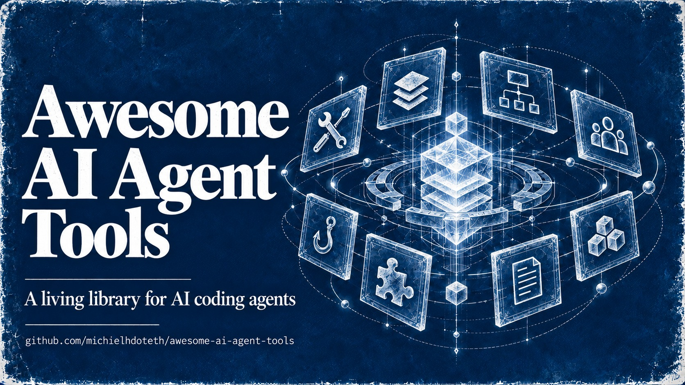

# Awesome AI Agent Tools

Installable components for AI coding assistants: skills, MCP servers, agent loops, subagents, hooks, plugins, prompts, and CLI tools, each with a source link and an install command.

**601** installable components across **8** categories. Every entry is sourced from a real open-source project. Works with Claude Code, OpenCode, Codex, Cursor, Gemini CLI, Copilot, and 30+ AI coding assistants.

## Contents

- [Skills](#skills)
- [MCPs](#mcps)
- [Agent Loops](#agent-loops)
- [Subagents](#subagents)
- [Hooks](#hooks)
- [Plugins](#plugins)
- [Prompts](#prompts)
- [Tools](#tools)

## Skills

94 skills across 9 categories: Development (31) · Productivity (17) · Design (11) · Content (10) · DevOps (8) · Marketing (6) · Data (5) · Testing (4) · Security (2)

Top 5 shown. Full list: [skills/](skills/) · [catalog.json](skills/catalog.json)

- [Executing Plans](https://github.com/obra/superpowers) - Executes implementation plans with verification at each step.
- [Frontend Design](https://github.com/anthropics/skills) - Creates distinctive, production-grade frontend interfaces with high design quality.
- [Grill Me](https://github.com/mattpocock/skills) - Get relentlessly interviewed about a plan or design until every branch of the decision tree is resolved.
- [Vercel React Best Practices](https://github.com/vercel-labs/agent-skills) - React and Next.js performance optimization guidelines from Vercel Engineering. 40+ rules across 8 categories.
- [Find Skills](https://github.com/vercel-labs/skills) - Discover and install new skills for your agent.

## MCPs

134 mcps across 19 categories: Developer Tools (15) · AI & Machine Learning (14) · Agent Orchestration (14) · Communication (11) · Databases (10) · Search (10) · DevOps (8) · Security (7) · Official Reference (6) · Research & Data (6) · Browser Automation (5) · Cloud Platforms (5) · Marketing (5) · Monitoring (5) · Finance (5) · Design (3) · Blockchain (3) · Data Engineering (1) · Mobile (1)

Top 5 shown. Full list: [mcps/](mcps/) · [catalog.json](mcps/catalog.json)

- [n8n MCP](https://github.com/n8n-io/n8n) - Fair-code workflow automation platform with native AI capabilities and 400+ integrations.
- [MarkItDown](https://github.com/microsoft/markitdown) - Converts PDF, Office, HTML and image files into clean Markdown for AI consumption.
- [Browser Use MCP](https://github.com/browser-use/browser-use) - AI-powered browser automation with 100K+ stars. Enables agents to browse the web, fill forms, extract data, and interact with web pages autonomously.
- [Filesystem MCP](https://github.com/modelcontextprotocol/servers) - Secure file read/write/list/search operations with configurable directory access controls.
- [Netdata MCP](https://github.com/netdata/netdata) - Real-time infrastructure monitoring with MCP integration for system metrics.

## Agent Loops

103 loops across 7 categories: engineering (53) · multi-agent (14) · evaluation (11) · meta (10) · operations (6) · design (6) · content (3)

Top 5 shown. Full list: [loops/](loops/) · [catalog.json](loops/catalog.json)

- [The docs sweep](https://github.com/Forward-Future/loopy) - Keeps documentation aligned with the current codebase.
- [Daily Triage Pattern](https://github.com/cobusgreyling/loop-engineering) - 1d-2h maintenance loop for triaging issues, PRs, and priorities.
- [Issue Burn-Down Line](https://github.com/rohanbalkondekar/agent-loop-patterns) - Curated backlog through worker, QA, and checkpoint stations.
- [Alpha Loop](https://github.com/bradtaylorsf/alpha-loop) - Agent-agnostic automated development loop: Plan -> Build -> Test -> Review -> Ship.
- [The Workflow Loop](https://github.com/iKon85/agent-workflow-kit) - Complete shipping loop for coding agents with Plan/Execute/Land/Learn phases.

## Subagents

31 subagents across 5 categories: Subagent Collection (15) · Agent Harness (6) · Official SDK (4) · Platform Format (4) · Curated Directory (2)

Top 5 shown. Full list: [subagents/](subagents/) · [catalog.json](subagents/catalog.json)

- [oh-my-openagent](https://github.com/code-yeongyu/oh-my-openagent) - Agent harness with async subagent orchestration. Manages subagent delegation, parallel execution, and result aggregation across multiple agent personas.
- [Microsoft Agent Framework](https://learn.microsoft.com/en-us/semantic-kernel/) - Microsoft's comprehensive framework for building autonomous AI agents with multi-agent patterns, Azure integration, and .NET/Python support.
- [awesome-claude-code](https://github.com/hesreallyhim/awesome-claude-code) - Ecosystem directory indexing 47K+ stars of Claude Code resources including subagent collections, skills, MCP servers, and community extensions.
- [awesome-claude-code-subagents](https://github.com/VoltAgent/awesome-claude-code-subagents) - Curated list of 154+ Claude Code subagent definitions including code-reviewer, debugger, test-writer, planner, and more. VoltAgent's definitive collection of reusable agent personas.
- [oh-my-codex](https://github.com/Yeachan-Heo/oh-my-codex) - Codex orchestration harness with 33 agent prompts. Manages subagent lifecycle, handoffs, and coordinated task execution for Codex CLI.

## Hooks

23 hooks across 7 categories: Security (4) · Automation (4) · Session Management (4) · Quality (3) · Safety (3) · Utility (3) · Notifications (2)

Top 5 shown. Full list: [hooks/](hooks/) · [catalog.json](hooks/catalog.json)

- [Secret Scanner](https://github.com/rohitg00/awesome-claude-code-toolkit) - Scans for leaked secrets (API keys, tokens, passwords) before writing or editing files.
- [Block Dangerous Commands](https://github.com/karanb192/claude-code-hooks) - Blocks rm -rf, fork bombs, curl|sh, and other destructive shell commands.
- [Lasso Security Prompt Injection Defenses](https://github.com/lasso-security/claude-hooks) - Enterprise-grade prompt injection detection and prevention hooks for Claude Code. Detects and blocks indirect prompt injection attacks via tool outputs.
- [awesome-claude-code-hooks](https://github.com/ithiria894/awesome-claude-code-hooks) - Curated directory of Claude Code hooks organized by category. Meta-resource for discovering hooks in the ecosystem.

## Plugins

51 plugins across 9 categories: Claude Code (11) · OpenCode (9) · Cross-Tool (8) · VS Code AI (6) · Cursor (5) · Windsurf (4) · JetBrains (4) · Copilot (3) · Aider (1)

Top 5 shown. Full list: [plugins/](plugins/) · [catalog.json](plugins/catalog.json)

- [Superpowers Plugin](https://superpowers.dev) - Comprehensive skill pack with 60+ pre-built skills for Claude Code workflows.
- [Official Claude Code Marketplace](https://claude.ai/plugins) - Official marketplace for Claude Code plugins with 255+ community-contributed extensions.
- [Awesome CursorRules](https://github.com/PatrickJS/awesome-cursorrules) - Curated collection of cursor rules by PatrickJS with 20K stars.
- [AgentEnv](https://github.com/kvcache-ai/AgentENV) - Project-scoped AI agent and plugin environment manager. Manages agent configurations across multiple AI coding tools.
- [Flutter Agent Plugins](https://docs.flutter.dev/ai/get-started) - Official Flutter team agent plugins bundling Flutter skills, rules, and Dart/Flutter MCP config for widget tests, layout, routing, and architecture.

## Prompts

84 prompts across 17 categories: Coding (9) · Architecture (8) · Image Generation (8) · DevOps (6) · General Purpose (6) · Code Review (5) · Debugging (5) · Documentation (5) · Reasoning (5) · Testing (4) · Data (4) · Design (4) · Productivity (4) · Agent Workflows (4) · Security (3) · Content (3) · Marketplace (1)

Top 5 shown. Full list: [prompts/](prompts/) · [catalog.json](prompts/catalog.json)

- [Senior Code Reviewer](https://github.com/f/prompts.chat) - Thorough code review with security, performance, and maintainability analysis.
- [Prompt Engineer](https://github.com/dair-ai/Prompt-Engineering-Guide) - Meta-prompt for designing and optimizing other prompts.
- [Craft Code Refactor](https://github.com/hoangatg/awesome-ai-prompts-2026) - Systematic code improvement with test coverage maintenance.
- [SQL Query Optimizer](https://github.com/openai/openai-cookbook) - Analyze and optimize SQL queries with index suggestions.
- [Image Generation Prompt Crafter](https://github.com/Ryan-yang125/gpt-image-2-prompts) - Craft detailed prompts for DALL-E, Midjourney, and Flux.

## Tools

81 tools across 14 categories: AI Coding CLIs (14) · Code Analysis (9) · Cloud & DevOps (7) · Formatting & Linting (7) · Agent Training & Eval (7) · Git Utilities (6) · Package Managers (5) · Docker & Containers (5) · API Testing (5) · Database CLIs (4) · Monitoring (4) · Agent Memory (3) · Terminal Enhancement (3) · AI APIs (2)

Top 5 shown. Full list: [tools/](tools/) · [catalog.json](tools/catalog.json)

- [Ollama](https://github.com/ollama/ollama) - Run LLMs locally. Llama, Mistral, Phi, Gemma, and more.
- [Gemini CLI](https://github.com/google-gemini/gemini-cli) - Google's AI coding agent in the terminal.
- [Claude Code](https://github.com/anthropics/claude-code) - Anthropic's agentic coding tool. Terminal-native AI pair programmer.
- [Bun](https://github.com/oven-sh/bun) - Incredibly fast JavaScript runtime, bundler, and package manager.
- Netdata - Real-time performance and health monitoring.

## Contributing

We welcome contributions! You can:

1. Manual PR -- fork, add an entry to a `catalog.json` file, validate, and submit. See [contributing.md](contributing.md).
2. Agent-automated -- give your AI agent the contributing.md guide and it handles everything.
3. Open an issue -- suggest a tool we should add.

All data comes from `catalog.json` files in each folder. These catalogs are the single source of truth for programmatic discovery.
